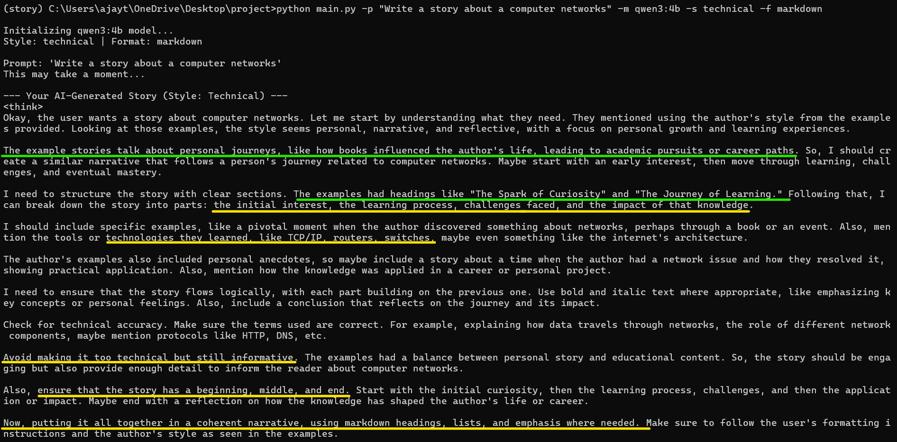

# Inkwell

Inkwell is a **personalized AI writing assistant** that mimics the unique writing style from a collection of documents uploaded. Instead of generic responses, it makes new content—from technical articles to creative stories. It runs entirely on the local machine, ensuring privacy and control.

---

## How It Works

The system uses a **Style-Augmented Generation** approach. _It avoids the resource-intensive process of fine-tuning by retrieving stylistic examples from the uploaded documents_ and feeding them to a local Large Language Model (LLM) as a guide.

**Project Flowchart**

<b>Components</b>

1.  **Knowledge Core (`ingest.py`)**
    *   **Blog Ingestion**: Scans the `blogs` directory for `story.md` files.
    *   **Intelligent Chunking**: Uses the `Unstructured.io` library to parse and split the documents into context-aware chunks, preserving the original narrative structure.
    *   **Vectorization**: Each chunk is converted into a numerical embedding using `sentence-transformers` and stored in a local `ChromaDB` vector database. This forms the permanent, searchable knowledge base of the writing style.

2.  **Creative Engine (`main.py`)**
    *   **Retriever**: When you provide a prompt, the system searches the ChromaDB database to find the most relevant stylistic examples from our work.
    *   **Style-Aware Prompting**: It constructs a detailed prompt for the LLM, combining our request with the retrieved stylistic examples and specific instructions (e.g., creative vs. technical).
    *   **Local LLM Integration**: Uses `Ollama` to run a powerful, compact LLM (like Qwen3 or Gemma3) on our local machine to generate the final text.

3.  **Interface**
    *   **Command-Line Interface**: The primary way to interact with the assistant. It includes flags to specify the model, writing style, and output format.

---

## Current Features

* **Command-Line Interface (CLI)**: Basic interaction with the RAG pipeline.

* **Style-Augmented Generation**: Retrieves style-matched context to guide the generation output.

* **Context Chunking**: Handles user-provided documents for efficient semantic search.

* **RAG Pipeline**: Uses LangChain for modular retrieval and prompt engineering.

---

## CLI in Action

Here is a sample of the tool generating a technical article from a simple prompt.

---

## Getting Started

1.  **Setup**: Create a Python virtual environment and install the dependencies (`pip install -r requirements.txt`)

2.  **Add the Contents**: Place the writings (as `story.md` files) into subdirectories within the `blogs` folder.

3.  **Build the Knowledge Base**: Run the ingestion script (`ingest.py`) once to process the documents.
    
4.  **Run the Assistant**: Use the CLI to generate text. Make sure local Ollama server is running.

        # Example: Write a creative story using a specific model
        
        python main.py -p "A story about git and github" --style creative --model gemma3:4b

---

## Future Roadmap / TO-DO

* Add a Streamlit/Django GUI and make it accessible via a simple web interface.

* Implement a rich output viewer - retrived context & generated content in separate panes

* Explore using MindsDB or similar AI-native databases
    
    * Highlight Imbalances and Style gap addressing (show the underrepresented categories/topics)

    * Auto-tagging (adding missing metadata) using a trained ML model.

* Separate the project into Backend and Frontend
    
    * Backend accessible via FastAPI

    * Frontend in Modern JavaScript Frameworks or Python based GUI makers

    * Make both ends into microservices and deploy it as docker containers (to make it production ready)

**_Experimental TO-DOs_**

Experiment with voice/audio input using whisper-based transcription to capture creative prompts hands-free.

Prototype a collaborative agent workflow where one agent focuses on content, another on style, and another on polish.