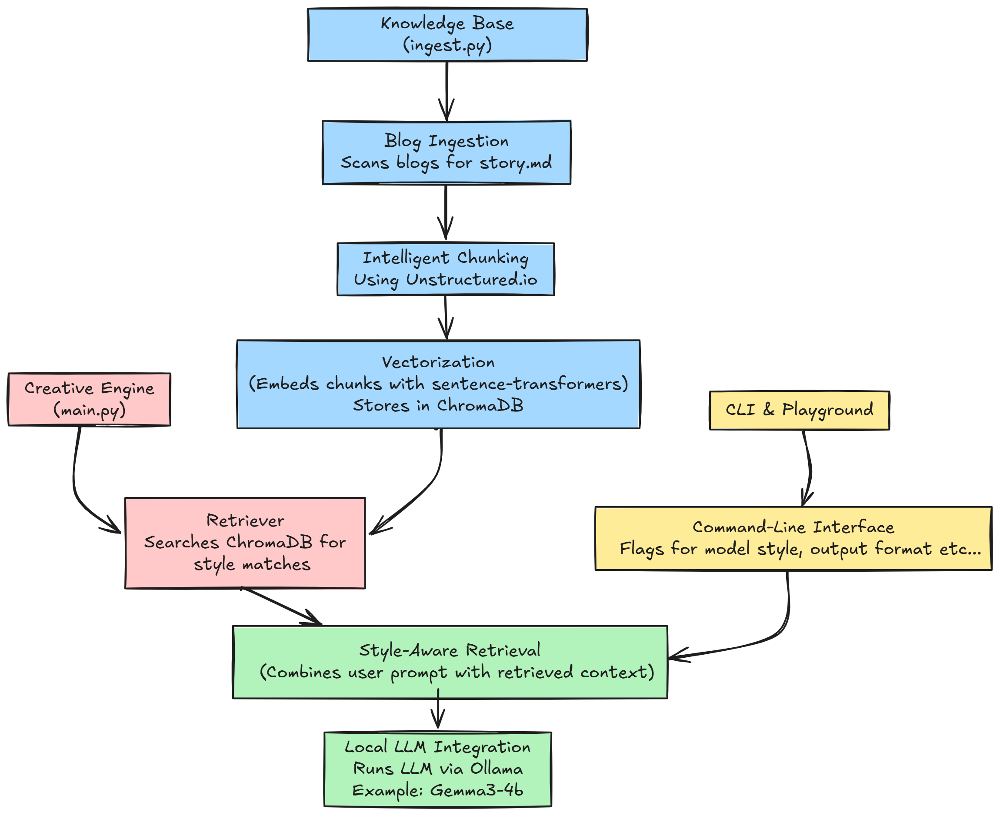

# Inkwell

Inkwell is a personalized AI writing assistant that learns your unique writing style from a collection of your documents. Instead of generic responses, it crafts new content—from technical articles to creative stories—that mirrors your own voice and narrative techniques. It runs entirely on your local machine, ensuring privacy and control.

---

## How It Works

The system uses a "Style-Augmented Generation" approach. It avoids the resource-intensive process of fine-tuning by retrieving stylistic examples from your work and feeding them to a local Large Language Model (LLM) as a guide.



### Components

1.  **Knowledge Core (`ingest.py`)**
    *   **Blog Ingestion**: Scans the `blogs` directory for your `story.md` files.
    *   **Intelligent Chunking**: Uses the `Unstructured.io` library to parse and split your documents into context-aware chunks, preserving the original narrative structure.
    *   **Vectorization**: Each chunk is converted into a numerical embedding using `sentence-transformers` and stored in a local `ChromaDB` vector database. This forms the permanent, searchable knowledge base of your writing style.

2.  **Creative Engine (`main.py`)**
    *   **Retriever**: When you provide a prompt, the system searches the ChromaDB database to find the most relevant stylistic examples from your work.
    *   **Style-Aware Prompting**: It constructs a detailed prompt for the LLM, combining your request with the retrieved stylistic examples and specific instructions (e.g., creative vs. technical).
    *   **Local LLM Integration**: Uses `Ollama` to run a powerful, compact LLM (like Qwen2 or Gemma2) on your local machine to generate the final text.

3.  **CLI & Playground**
    *   **Command-Line Interface**: The primary way to interact with the assistant. It includes flags to specify the model, writing style, and output format.
    *   **Jupyter Notebook (`playground.ipynb`)**: An interactive environment to explore the system's inner workings, view retrieved contexts, and experiment with the generation process.

---

## Examples

**CLI in Action**

Here is a sample of the tool generating a technical article from a simple prompt.


**Exploring with the Playground**

The notebook provides a transparent view into the retrieval and prompt construction process.


---

## Getting Started

1.  **Setup**: Create a Python virtual environment and install the dependencies:
    ```bash
    python -m venv story
    .\story\Scripts\activate
    pip install -r requirements.txt
    ```

2.  **Add Your Content**: Place your writings (as `story.md` files) into subdirectories within the `blogs` folder.

3.  **Build the Knowledge Base**: Run the ingestion script once to process your documents.
    ```bash
    python ingest.py
    ```

4.  **Run the Assistant**: Use the CLI to generate text. Make sure your local Ollama server is running.
    ```bash
    # See all options
    python main.py -h

    # Example: Write a creative story using a specific model
    python main.py "A story about a clockmaker who can control time" --style creative --model gemma2:9b-instruct-q4_K_M
    ```

---

<details>
<summary><b>Future Roadmap</b></summary>

- **Web Interface**: Develop a simple web UI (using Flask or FastAPI) for a more user-friendly experience.
- **Advanced Style Control**: Implement more granular style controls, such as specifying the tone (e.g., humorous, formal) or targeting specific sub-collections of documents.
- **Real-time Ingestion**: Add a feature to watch the `blogs` directory for changes and automatically update the vector store.
- **Interactive Editing**: Create a mode where the AI suggests completions or rephrasing for a piece of text you are actively writing.
- **Model Evaluation**: Build a small suite to compare the output quality of different local LLMs for your specific writing style.

</details>
